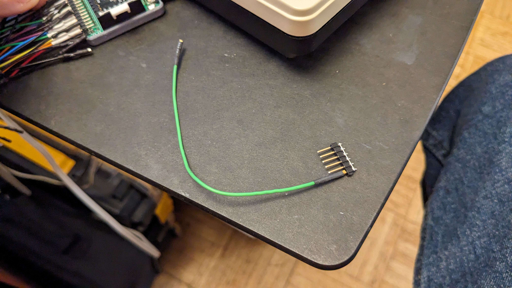
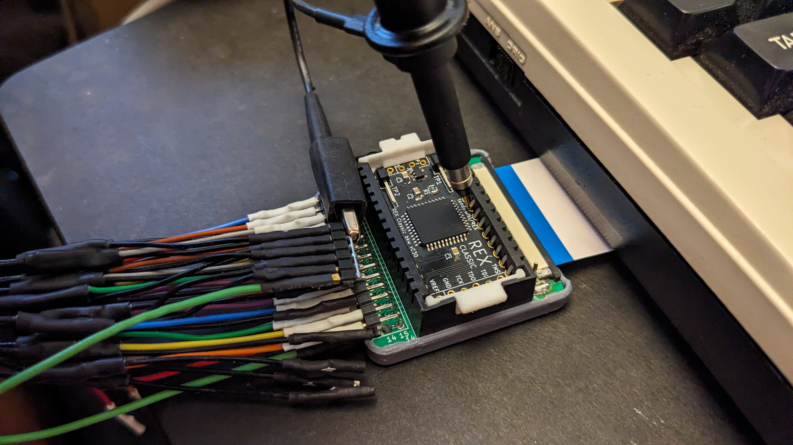

# Molex 7880x BUS TAP
Bus tap to fit between a Molex 78805 socket and a chip in a Molex 78802 carrier

More pics: https://photos.app.goo.gl/PHQ1rTQFpPRF6NSh8

Provides a connection point for a logic analyzer or oscilloscope to tap the bus between a Molex 78805 socket and a mating Molex 78802 carrier module that would normally be in the socket.

## Parts

Carrier for the small PCB: https://github.com/bkw777/Molex78802_Module/blob/master/Carrier/Molex78802_PCB_28.stl  
&nbsp;&nbsp;Some places to buy from. Select Material: Nylon, Process: SLS or MJF  
&nbsp;&nbsp;https://www.sculpteo.com/en/print/molex78802_pcb_28-18/nC7YgK6X  
&nbsp;&nbsp;https://www.pcbway.com/project/shareproject/Molex_7880x_28_PCB_Carrier_9419cd9c.html

Housing for the large PCB: [CASE/Molex_7880x_bus_tap_cover.stl](CASE/Molex_7880x_bus_tap_cover.stl)  
&nbsp;&nbsp;This one can be FDM printed.

FFC connector (x2): https://www.digikey.com/en/products/detail/amphenol-cs-fci/F52R-1A7H1-11028/11564624

FFC cable - 4" gold - Molex 0150390449 : https://www.digikey.com/en/products/detail/molex/0150390449/11581605  
FFC Cable - 6" gold - Molex 0150390453 : https://www.digikey.com/en/products/detail/molex/0150390453/11581883  
Other FFC Cables in other lengths, copper weight, plating options: https://www.digikey.com/short/pqq5pd04  

Molex 78805 socket: These are no longer made. Find me on the M100 mail list.  
Other options in place of the socket, none very good...  
* Once in a great while they turn up on ebay or other on-line parts supplier
* Use a standard DIP-28 socket, dupont wires, and a DIP-28 test clip. https://ebay.com/itm/403250810350  
* Solder long pins in place of the socket and wedge the module between the pins. https://www.digikey.com/en/products/detail/samtec-inc/ZW-16-15-F-S-225-175/6614101
The width of the module is a little wider than the width of the pins, so the pins need to bend out a little.  

TODO: Design a socket that can be printed and just needs plain wire for the contacts.

Machines with this socket:  
* TRS-80/TANDY Model 100, 102, 200, 600
* Kyotronic KC-85
* Epson PX-4, PX-8
* Intermec 9440, Telexon 710, and similar hand-held teriminals
* Allen-Bradley SLC 500 programmable controllers

Cable notes:  
4" is long enough to reach out from under the nearest side to the socket on all machines.  
6" is long enough to reach the left instead of the front on a Model 200.  
8" is long enough to reach the back on a Model 100, and does still work, but might be getting marginal at this length.  
10" untested  
12" does not work

# PINOUTS
<table>
<tr> <th colspan=4>TANDY 100/102/200</th> <th width=100></th> <th colspan=4>TANDY 600 / Epson PX-4/8 (STANDARD MASK ROM)</th> </tr>
<tr> <td>VCC</td><td>1</td><td>28</td><td>A14</td> <td></td>  <td>NC</td><td>1</td><td>28</td><td>VCC</td> </tr>
<tr> <td>A10</td><td></td><td></td><td>/CS</td> <td></td>  <td>A12</td><td></td><td></td><td>A14</td> </tr>
<tr> <td>A7</td><td></td><td></td><td>A8</td> <td></td>  <td>A7</td><td></td><td></td><td>A13</td> </tr>
<tr> <td>A6</td><td></td><td></td><td>A9</td> <td></td>  <td>A6</td><td></td><td></td><td>A8</td> </tr>
<tr> <td>A5</td><td></td><td></td><td>A12</td> <td></td>  <td>A5</td><td></td><td></td><td>A9</td> </tr>
<tr> <td>A4</td><td></td><td></td><td>ALE</td> <td></td>  <td>A4</td><td></td><td></td><td>A11</td> </tr>
<tr> <td>A3</td><td></td><td></td><td>A13</td> <td></td>  <td>A3</td><td></td><td></td><td>/OE</td> </tr>
<tr> <td>A2</td><td></td><td></td><td>/OE</td> <td></td>  <td>A2</td><td></td><td></td><td>A10</td> </tr>
<tr> <td>A1</td><td></td><td></td><td>A11</td> <td></td>  <td>A1</td><td></td><td></td><td>/CS</td> </tr>
<tr> <td>A0</td><td></td><td></td><td>AD7</td> <td></td>  <td>A0</td><td></td><td></td><td>D7</td> </tr>
<tr> <td>AD0</td><td></td><td></td><td>AD6</td> <td></td>  <td>D0</td><td></td><td></td><td>D6</td> </tr>
<tr> <td>AD1</td><td></td><td></td><td>AD5</td> <td></td>  <td>D1</td><td></td><td></td><td>D5</td> </tr>
<tr> <td>AD2</td><td></td><td></td><td>AD4</td> <td></td>  <td>D2</td><td></td><td></td><td>D4</td> </tr>

<tr> <td>GND</td><td>13</td><td>14</td><td>AD3</td> <td></td>  <td>GND</td><td>13</td><td>14</td><td>D3</td> </tr>
</table>
<!--
|     |     |     |     |     |     |     |     |     |     |
| --- | --- | --- | --- | --- | --- | --- | --- | --- | --- |
| VCC | 1   | 28  | A14 |     |     | NC  | 1   | 28  | VCC |
| A10 |     |     | /CS |     |     | A12 |     |     | A14 |
| A7  |     |     | A8  |     |     | A7  |     |     | A13 |
| A6  |     |     | A9  |     |     | A6  |     |     | A8  |
| A5  |     |     | A12 |     |     | A5  |     |     | A9  |
| A4  |     |     | ALE |     |     | A4  |     |     | A11 |
| A3  |     |     | A13 |     |     | A3  |     |     | /OE |
| A2  |     |     | /OE |     |     | A2  |     |     | A10 |
| A1  |     |     | A11 |     |     | A1  |     |     | /CS |
| A0  |     |     | AD7 |     |     | A0  |     |     | D7  |
| AD0 |     |     | AD6 |     |     | D0  |     |     | D6  |
| AD1 |     |     | AD5 |     |     | D1  |     |     | D5  |
| AD2 |     |     | AD4 |     |     | D2  |     |     | D4  |
| GND | 13  | 14  | AD3 |     |     | GND | 13  | 14  | D3  |
-->

# GND pins work-around
This thing could really use a bunch more GND pins, both for logic analyzer probes and for a place to clip oscilloscope probe alligator clips.
Currently there is only the single GND pin which is pin 13.

For now a simple work-around that provides both extra pins for logic analyzer probe grounds and a perfect place for a scope probe alligator clip, is just a piece of single row male pin header with a wire soldered to bridge all of the posts, and a single short female-female dupont jumper to connect to the single gnd pin.

# Related
http://tandy.wiki/Molex78802_Module  
https://github.com/bkw777/M4ROM  
http://tandy.wiki/Teeprom  
http://tandy.wiki/REX  
