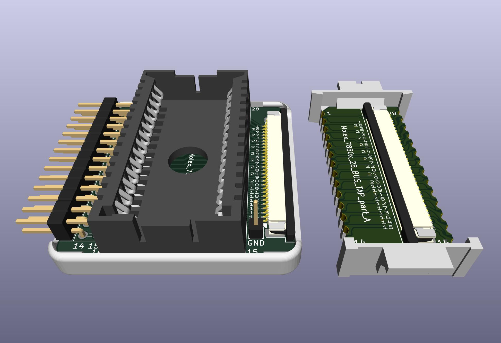

# Molex 7880x BUS TAP
Bus tap to fit between a Molex 78805 socket and a chip in a Molex 78802 carrier

Provides a connection point for a logic analyzer or oscilloscope to tap the bus between a Molex 78805 socket and a mating Molex 78802 carrier module that would normally be in the socket.

## Parts

Carrier: https://shpws.me/SGGB

FFC connector (x2): https://www.digikey.com/en/products/detail/amphenol-cs-fci/F52R-1A7H1-11028/11564624

FFC cable (8" gold): https://www.digikey.com/en/products/detail/molex/0150390457/11581568  
Other FFC Cables in other lengths and plating options: https://www.digikey.com/short/pqq5pd04

Molex 78805 socket: These are no longer made. Find me on the M100 mail list.  
Other options, none very good...  
* Use a standard DIP-28 socket, dupont wires, and a DIP-28 test clip. https://ebay.com/itm/403250810350  
* Solder long pins in place of the socket and wedge the module between the pins. https://www.digikey.com/en/products/detail/samtec-inc/ZW-16-15-F-S-225-175/6614101
The width of the module is a little wider than the width of the pins, so the pins need to bend out a little.  

TODO: Design a printable socket.

Machines with this socket:  
* TRS-80/TANDY Model 100, 102, 200, 600
* Kyotronic KC-85
* Epson PX-4, PX-8
* Intermec 9440, Telexon 710, and similar hand-held teriminals
* Allen-Bradley SLC 500 programmable controllers

Related:  
http://tandy.wiki/Molex78802_Module  
https://github.com/bkw777/M4ROM  
http://tandy.wiki/Teeprom  
http://tandy.wiki/REX  
